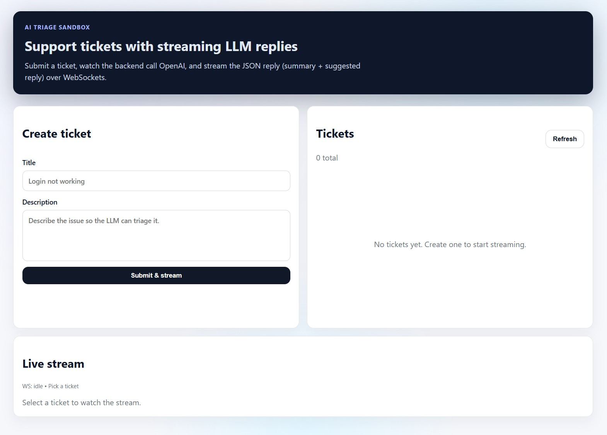

# fastapi-react-vite-llm-streaming-demo

A tiny full-stack demo that teaches the “full-stack AI app” basics: a FastAPI backend (REST + WebSockets) and a Vite/React frontend that streams an LLM response in real time.

  

## What it does
- You submit a “ticket” (title + description) in the UI.
- The backend calls OpenAI to generate a JSON result: `summary` + `suggested_reply`.
- Tokens stream to the browser over a WebSocket while the model responds.

## Tech stack
- Backend: Python, FastAPI, Uvicorn, OpenAI SDK
- Frontend: React, TypeScript, Vite

## Repo structure
- `backend/` - FastAPI app (`main.py`)
- `frontend/` - Vite + React + TS app
- `sh_start_backend.ps1` / `sh_start_frontend.ps1` - helper scripts to run locally

## Run locally
1) Set your key in `.env` (repo root): `OPENAI_API_KEY=...`
2) Start backend: `./sh_start_backend.ps1` (or `cd backend && python -m uvicorn main:app --reload --port 8000`)
3) Start frontend: `./sh_start_frontend.ps1` (or `cd frontend && npm run dev`)

The frontend defaults to `http://localhost:8000` for the API. Override with `VITE_API_BASE_URL`.

## More docs
- `README1.md` - comprehensive/pro-style documentation
- `README2.md` - very detailed beginner-friendly explanation
